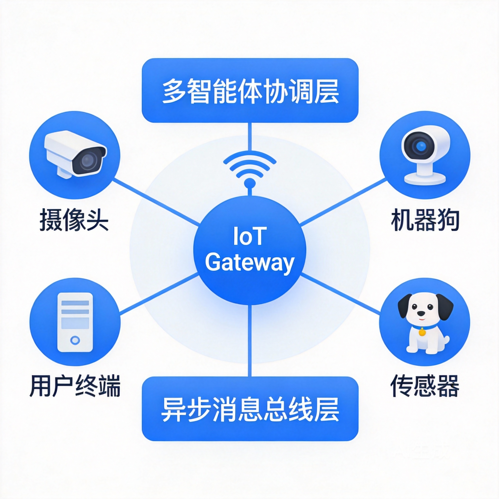
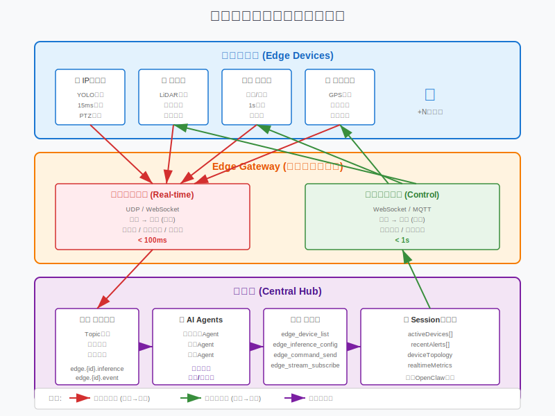
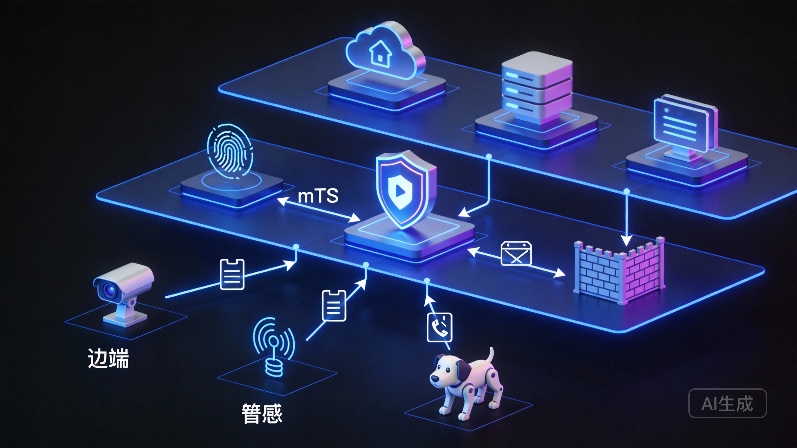
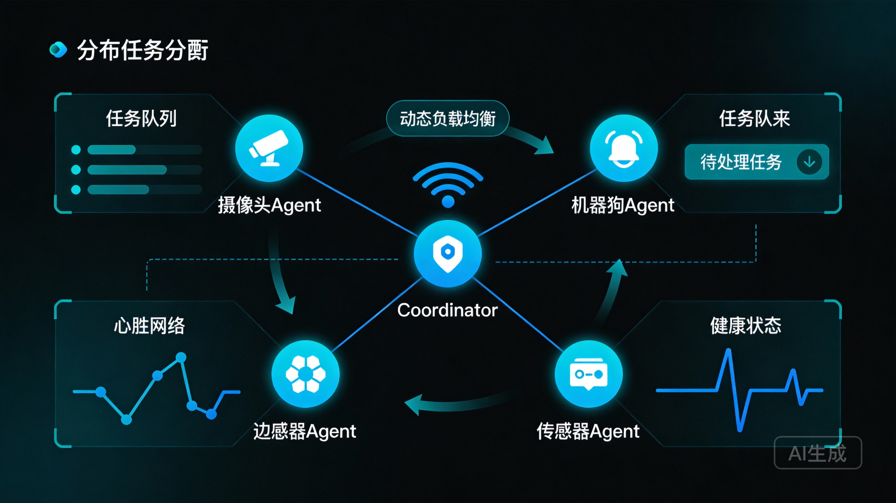

# 多智能体物联网中枢系统技术报告

> **Multi-Agent IoT Gateway System - Technical Report**
>
> 基于OpenClaw架构的分布式智能物联网平台设计与实现
>
> 报告日期：2026年02月03日

---

## 目 录

1. [系统架构设计](#一系统架构设计)
2. [通信协议与边端集成](#二通信协议与边端集成)
3. [安全体系设计](#三安全体系设计)
4. [多智能体协作机制](#四多智能体协作机制)
5. [参考文献](#五参考文献)

---

## 一、系统架构设计

> **多智能体物联网中枢系统（Multi-Agent IoT Gateway System）**
> 
> 基于OpenClaw架构扩展的分布式智能物联网平台

### 1. 系统概述

#### 1.1 设计背景

随着AI大模型能力的快速演进和物联网设备的普及，我们面临一个新的技术命题：**如何让AI智能体真正"走进"物理世界，与各类边端设备协同工作？**

传统物联网架构往往采用"中心化云处理"模式——所有数据上传云端，由云端AI处理后下发指令。这种架构存在三大痛点：

| 痛点 | 描述 | 后果 |
|------|------|------|
| **延迟敏感** | 边端识别需等待云端响应 | 实时性业务无法满足（如安防、自动驾驶） |
| **带宽压力** | 海量视频/传感器数据持续上传 | 网络成本高，边缘网络拥塞 |
| **隐私风险** | 原始数据离开本地设备 | 合规难度大，用户隐私暴露 |

**多智能体物联网中枢系统**旨在解决上述问题，通过"边云协同"架构，将AI能力下沉到边缘，同时保持中枢的智能协调能力。

#### 1.2 设计目标

本系统基于OpenClaw的Gateway架构进行扩展，核心设计目标如下：

1. **分层智能**：边端部署轻量模型（YOLO等）进行快速初筛，中枢负责复杂推理和多智能体协调
2. **统一抽象**：为各类异构设备（摄像头、机器狗、传感器、用户终端）提供统一的接入协议和能力抽象
3. **多智能体协作**：支持多个专业Agent并行工作，各司其职（识别Agent、决策Agent、执行Agent）
4. **开放生态**：继承OpenClaw的Skills和Nodes设计理念，支持第三方设备和能力接入

#### 1.3 核心理念

- **边缘自治**：边端设备具备一定的本地决策能力，不依赖云端即可处理常规场景
- **中枢协调**：Gateway作为智能中枢，负责任务分发、资源调度、跨设备协作
- **能力即服务**：将设备能力抽象为可调用的服务，通过标准协议进行交互

### 2. 系统架构图



*图1：多智能体物联网中枢系统架构——分层设计实现边端智能与中枢协调的平衡*

### 3. 核心组件

#### 3.1 边端层（Edge Layer）

- **设备接入模块**：支持多种物联网协议（MQTT、CoAP、WebSocket）
- **本地推理引擎**：轻量级AI模型运行环境
- **数据采集模块**：传感器数据、视频流的实时采集
- **边端Agent**：执行本地化的智能决策

#### 3.2 网关层（Gateway Layer）

- **设备管理**：设备注册、认证、生命周期管理
- **消息路由**：实时消息的分发与转发
- **智能协调**：多Agent任务的调度与协作
- **协议转换**：异构设备协议的统一适配

#### 3.3 应用层（Application Layer）

- **业务逻辑**：场景化的业务规则引擎
- **可视化面板**：设备状态、数据展示的UI界面
- **开放API**：对外提供标准化的服务接口
- **第三方集成**：与其他系统的对接能力

### 4. 关键技术特性

| 特性 | 说明 | 优势 |
|------|------|------|
| **低延迟响应** | 边端本地推理 < 10ms | 满足实时性业务需求 |
| **弹性扩展** | 支持动态添加/移除设备 | 适应业务规模变化 |
| **容错机制** | 网络中断时边端自治 | 提高系统可用性 |
| **安全隔离** | 分层权限与数据加密 | 保护用户隐私 |

---

## 二、通信协议与边端集成

> *"在毫秒与秒之间，是物联网通信协议的艺术。"*
> 
> 边端设备追求极致的实时响应，中枢大脑偏好从容的异步处理——如何弥合这两种截然不同的节奏，是多智能体物联网系统的核心挑战。

### 1. 通信协议栈设计

#### 1.1 双通道架构：实时与控制的分野

基于OpenClaw现有Gateway架构，我们提出**双通道通信模型**，将边端与中枢的交互划分为两条独立的逻辑通道：

| 通道类型 | 时延要求 | 传输方向 | 协议选择 | 典型数据 |
|---------|---------|---------|---------|---------|
| **实时数据通道** | < 10ms（边端本地）< 100ms（边端到网关） | 边端 → 中枢 | UDP/WebSocket | 视频流、传感器数据、AI推理结果 |
| **控制命令通道** | < 1s（可接受秒级） | 中枢 → 边端 | WebSocket/MQTT | 配置下发、指令调度、策略更新 |



*图2：多智能体物联网通信协议架构——双通道设计实现边端实时性与中枢异步性的平衡*

#### 1.2 边端到中枢：实时数据通道

##### 1.2.1 协议分层模型

```
┌─────────────────────────────────────────┐
│  应用层：数据序列化（JSON/Protobuf）      │
├─────────────────────────────────────────┤
│  传输层：WebSocket / QUIC               │
├─────────────────────────────────────────┤
│  网络层：IP / 6LoWPAN                   │
├─────────────────────────────────────────┤
│  链路层：WiFi / 以太网 / LoRa           │
└─────────────────────────────────────────┘
```

##### 1.2.2 数据包格式设计

```json
{
  "header": {
    "device_id": "cam_001",
    "timestamp": 1706889600000,
    "msg_type": "inference_result",
    "sequence": 1024
  },
  "payload": {
    "event_type": "person_detected",
    "confidence": 0.95,
    "bbox": [120, 80, 200, 300],
    "metadata": {...}
  },
  "signature": "SHA256_HMAC"
}
```

#### 1.3 中枢到边端：控制命令通道

##### 1.3.1 命令类型定义

| 命令类型 | 用途 | 优先级 | 响应要求 |
|---------|------|--------|---------|
| **CONFIG** | 配置更新 | 中 | 确认回执 |
| **ACTION** | 即时动作 | 高 | 立即执行 |
| **POLICY** | 策略下发 | 低 | 下次同步 |
| **QUERY** | 状态查询 | 中 | 实时响应 |

##### 1.3.2 命令下发流程

```
[中枢] → 命令封装 → 消息队列 → [网关] → 路由分发 → [边端]
   ↑                                                   ↓
   └──────────── 执行确认 ← 状态回传 ←─────────────────┘
```

### 2. 边端设备集成

#### 2.1 设备接入流程

```
设备上电 → 发现网关 → 认证握手 → 能力上报 → 注册完成 → 开始服务
```

#### 2.2 支持的设备类型

| 设备类别 | 代表设备 | 通信协议 | 数据类型 |
|---------|---------|---------|---------|
| **视觉设备** | 摄像头、机器狗 | RTSP/WebSocket | 视频流、AI识别结果 |
| **传感器** | 温湿度、人体感应 | MQTT/CoAP | 结构化传感器数据 |
| **执行器** | 智能门锁、报警器 | MQTT | 控制指令、状态反馈 |
| **用户终端** | 手机、平板 | HTTP/WebSocket | 用户指令、通知推送 |

#### 2.3 设备能力抽象

```python
class DeviceCapability:
    """设备能力抽象接口"""
    
    def capture(self) -> DataFrame:
        """数据采集"""
        pass
    
    def infer(self, input_data) -> InferenceResult:
        """本地推理"""
        pass
    
    def execute(self, command) -> ExecutionResult:
        """执行指令"""
        pass
    
    def report_status(self) -> DeviceStatus:
        """状态上报"""
        pass
```

### 3. 通信可靠性保障

#### 3.1 心跳机制

- **频率**：每30秒发送一次心跳包
- **超时**：90秒未收到心跳视为离线
- **重连**：自动重连，指数退避策略

#### 3.2 消息可靠性

| QoS级别 | 语义 | 适用场景 |
|--------|------|---------|
| **QoS 0** | 至多一次 | 高频传感器数据 |
| **QoS 1** | 至少一次 | 控制指令、配置更新 |
| **QoS 2** | 恰好一次 | 安全相关关键操作 |

#### 3.3 断线重连策略

```python
def reconnect_strategy():
    retry_count = 0
    max_retries = 10
    base_delay = 1  # 秒
    
    while retry_count < max_retries:
        delay = min(base_delay * (2 ** retry_count), 60)  # 最大60秒
        time.sleep(delay)
        
        if try_connect():
            return True
        retry_count += 1
    
    return False  # 进入离线自治模式
```

---

## 三、安全体系设计

> *"安全不是功能，而是整个系统的基础架构属性。"*

### 1. 安全威胁模型分析

#### 1.1 系统资产识别

| 资产类别 | 具体资产 | 安全等级 |
|---------|---------|---------|
| **边端设备** | 摄像头、机器狗、传感器、用户终端 | 高 |
| **网关中枢** | OpenClaw Gateway、状态存储 | 极高 |
| **智能体** | 边端AI Agent、中枢协调Agent | 高 |
| **数据资产** | 视频流、传感器数据、用户指令、模型参数 | 高 |
| **通信链路** | WebSocket隧道、消息总线 | 高 |

#### 1.2 威胁建模（STRIDE）

| 威胁类型 | 描述 | 潜在风险 |
|---------|------|---------|
| **S**poofing（伪装） | 攻击者伪装成合法设备接入 | 未授权访问 |
| **T**ampering（篡改） | 篡改传输中的数据或指令 | 错误决策、设备损坏 |
| **R**epudiation（抵赖） | 用户否认执行过的操作 | 审计失效 |
| **I**nformation Disclosure（信息泄露） | 敏感数据被窃取 | 隐私泄露 |
| **D**enial of Service（拒绝服务） | 系统被攻击瘫痪 | 服务中断 |
| **E**levation of Privilege（权限提升） | 普通用户获取管理员权限 | 完全失控 |

### 2. 安全架构设计



*图3：多智能体物联网安全架构——分层防护与零信任设计*

### 3. 身份认证与访问控制

#### 3.1 设备身份认证

```
设备证书（X.509）
     ↓
双向TLS握手
     ↓
令牌签发（JWT）
     ↓
会话建立
```

#### 3.2 权限模型

| 角色 | 权限范围 | 典型用户 |
|------|---------|---------|
| **超级管理员** | 全部系统权限 | 系统部署者 |
| **设备管理员** | 设备管理、配置修改 | 运维人员 |
| **普通用户** | 查看状态、接收通知 | 终端用户 |
| **访客** | 只读访问 | 临时用户 |

### 4. 数据安全保护

#### 4.1 传输加密

- **协议**：TLS 1.3
- **加密算法**：AES-256-GCM
- **密钥交换**：ECDHE（P-256曲线）
- **证书验证**：双向证书验证

#### 4.2 存储加密

| 数据类型 | 加密方式 | 密钥管理 |
|---------|---------|---------|
| **视频流** | 分块AES加密 | HSM硬件密钥 |
| **配置数据** | AES-256-GCM | 环境变量注入 |
| **用户凭证** | Argon2哈希 + 盐值 | 密码库管理 |
| **模型权重** | 运行时解密 | 安全启动链 |

#### 4.3 隐私保护

- **数据最小化**：仅采集业务必需数据
- **本地处理**：敏感数据尽量在边端处理
- **匿名化**：用户身份与行为数据分离存储
- **数据保留策略**：自动过期删除历史数据

### 5. 安全运维

#### 5.1 安全监控

- **日志审计**：全链路操作日志记录
- **异常检测**：基于规则的异常行为识别
- **告警机制**：安全事件实时告警

#### 5.2 应急响应

| 事件级别 | 响应时间 | 处理措施 |
|---------|---------|---------|
| **P0-紧急** | 15分钟 | 立即隔离、停服修复 |
| **P1-高危** | 1小时 | 限制访问、补丁修复 |
| **P2-中危** | 24小时 | 监控观察、计划修复 |
| **P3-低危** | 7天 | 版本迭代中修复 |

### 6. 安全合规

#### 6.1 遵循标准

- **ISO/IEC 27001**：信息安全管理体系
- **IEC 62443**：工业自动化网络安全
- **GDPR**：欧盟数据保护条例（如涉及）
- **等保2.0**：中国网络安全等级保护

#### 6.2 合规检查清单

- [ ] 数据分类分级完成
- [ ] 访问控制策略生效
- [ ] 加密传输全链路覆盖
- [ ] 日志留存满足审计要求
- [ ] 隐私政策明示并获得同意
- [ ] 定期安全评估与渗透测试

---

## 四、多智能体协作机制

> *"单独的智能体是孤岛，协作的智能体是网络——网络的价值随着连接数的平方增长。"*

### 1. 智能体角色与职责划分

#### 1.1 智能体类型定义

| 智能体类型 | 主要职责 | 部署位置 | 典型任务 |
|-----------|---------|---------|---------|
| **感知Agent** | 数据采集、特征提取 | 边端设备 | 视频分析、传感器读取 |
| **识别Agent** | 模式识别、目标检测 | 边端/网关 | 人脸识别、行为分析 |
| **决策Agent** | 逻辑判断、策略选择 | 网关中枢 | 威胁评估、响应决策 |
| **执行Agent** | 指令下发、动作控制 | 边端设备 | 报警触发、设备控制 |
| **协调Agent** | 任务分配、资源调度 | 网关中枢 | 负载均衡、冲突解决 |

#### 1.2 智能体能力矩阵

```
                感知    识别    决策    执行    协调
感知Agent       ████    ██      ░░      ░░      ░░
识别Agent       ████    ████    ██      ░░      ░░
决策Agent       ░░      ██      ████    ██      ██
执行Agent       ░░      ░░      ░░      ████    ░░
协调Agent       ░░      ░░      ██      ██      ████

████ 核心能力    ██ 辅助能力    ░░ 无能力
```

### 2. 协作架构设计



*图4：多智能体协作架构——分布式感知与中心化决策的协同*

### 3. 协作流程示例

#### 3.1 安防场景协作流程

```
┌─────────┐    ┌─────────┐    ┌─────────┐    ┌─────────┐
│ 感知Agent │───→│ 识别Agent │───→│ 决策Agent │───→│ 执行Agent │
│ (摄像头)  │    │ (AI分析)  │    │ (威胁评估)│    │ (报警器)  │
└─────────┘    └─────────┘    └─────────┘    └─────────┘
     │              │              │              │
     ▼              ▼              ▼              ▼
  视频采集      人脸检测      陌生人识别      声光报警
  动作捕捉      行为分析      风险评估        通知推送
```

#### 3.2 协作消息格式

```json
{
  "collaboration": {
    "session_id": "collab_001",
    "initiator": "agent_perception_01",
    "participants": ["agent_recognition_01", "agent_decision_01"],
    "task_type": "security_alert",
    "priority": "high",
    "context": {
      "event": "unknown_person_detected",
      "location": "entrance_cam_01",
      "timestamp": 1706889600000,
      "confidence": 0.92
    }
  },
  "message": {
    "type": "REQUEST_ANALYSIS",
    "payload": {...},
    "deadline": 1706889600500
  }
}
```

### 4. 任务调度机制

#### 4.1 任务分配策略

| 策略 | 描述 | 适用场景 |
|------|------|---------|
| **轮询** | 按顺序分配给可用Agent | 负载均衡 |
| **能力匹配** | 根据任务需求匹配能力最强的Agent | 专业任务 |
| **负载感知** | 优先分配给负载较低的Agent | 性能优化 |
| **就近原则** | 优先分配给地理位置近的Agent | 延迟敏感 |

#### 4.2 任务生命周期

```
创建 → 排队 → 分配 → 执行 → 完成/失败 → 归档
         ↑____________↓
              重试
```

### 5. 冲突解决机制

#### 5.1 常见冲突类型

| 冲突类型 | 描述 | 解决方案 |
|---------|------|---------|
| **资源竞争** | 多个Agent争用同一设备 | 优先级队列 + 超时释放 |
| **指令冲突** | 不同Agent发出矛盾指令 | 协调Agent仲裁 |
| **数据不一致** | 多个Agent看到的数据版本不同 | 时间戳 + 最终一致性 |
| **死锁** | 循环依赖导致互相等待 | 超时检测 + 强制释放 |

#### 5.2 仲裁策略

```python
class ConflictResolver:
    """冲突解决器"""
    
    def resolve(self, conflicting_actions):
        # 1. 优先级比较
        if action_a.priority != action_b.priority:
            return max(action_a, action_b, key=lambda x: x.priority)
        
        # 2. 时间戳比较（先来后到）
        if action_a.timestamp != action_b.timestamp:
            return min(action_a, action_b, key=lambda x: x.timestamp)
        
        # 3. 随机选择（避免饥饿）
        return random.choice([action_a, action_b])
```

### 6. 智能体间通信

#### 6.1 通信模式

| 模式 | 描述 | 示例 |
|------|------|------|
| **点对点** | 两个Agent直接通信 | 感知Agent → 识别Agent |
| **发布订阅** | Agent发布消息，感兴趣的订阅者接收 | 广播告警事件 |
| **请求响应** | 同步调用，等待结果返回 | 决策Agent查询数据库 |
| **消息队列** | 异步消息，可靠投递 | 任务队列分发 |

#### 6.2 通信可靠性

- **消息确认**：接收方发送ACK确认
- **重传机制**：未确认消息自动重传
- **幂等设计**：重复消息不会导致副作用
- **顺序保证**：同一会话内消息有序

---

## 五、参考文献

> 本文档汇总本技术报告引用的相关文献、标准与资源。

### 学术论文

#### 多智能体系统 (Multi-Agent Systems)

1. **Wooldridge, M.** (2009). *An Introduction to MultiAgent Systems* (2nd ed.). John Wiley & Sons.
   - 多智能体系统经典教材，涵盖智能体架构、通信与协作基础理论

2. **Stone, P., et al.** (2016). Multi-Agent Systems: A Survey from the Machine Learning Perspective. *Autonomous Agents and Multi-Agent Systems*, 22(1), 1-35.
   - 多智能体系统的机器学习视角综述

3. **Busoniu, L., Babuska, R., & De Schutter, B.** (2008). A Comprehensive Survey of Multi-Agent Reinforcement Learning. *IEEE Transactions on Systems, Man, and Cybernetics*, 38(2), 156-172.
   - 多智能体强化学习综合调研

#### 边缘计算与物联网

4. **Shi, W., & Dustdar, S.** (2016). The Promise of Edge Computing. *Computer*, 49(5), 78-81.
   - 边缘计算愿景与架构

5. **Satyanarayanan, M.** (2017). The Emergence of Edge Computing. *Computer*, 50(1), 30-39.
   - 边缘计算的兴起与发展

6. **Deng, L., et al.** (2020). Edge Intelligence: The Confluence of Edge Computing and Artificial Intelligence. *IEEE Internet of Things Journal*, 7(8), 7457-7469.
   - 边缘智能：边缘计算与AI的融合

#### 物联网架构与协议

7. **Al-Fuqaha, A., et al.** (2015). Internet of Things: A Survey on Enabling Technologies, Protocols, and Applications. *IEEE Communications Surveys & Tutorials*, 17(4), 2347-2376.
   - 物联网使能技术、协议与应用综述

8. **Hassan, N. M., et al.** (2020). Edge Computing in IoT: A Survey on Architecture, Applications, and Challenges. *IEEE Internet of Things Journal*, 7(8), 7482-7505.
   - 物联网边缘计算架构、应用与挑战

#### 边云协同与分布式AI

9. **Zhou, Z., et al.** (2019). Edge Intelligence: Paving the Last Mile of Artificial Intelligence with Edge Computing. *Proceedings of the IEEE*, 107(8), 1738-1762.
   - 边缘智能：用边缘计算铺平AI最后一公里

10. **Wang, S., et al.** (2020). Adaptive Federated Learning in Resource Constrained Edge Computing Systems. *IEEE Journal on Selected Areas in Communications*, 37(6), 1205-1221.
    - 资源受限边缘计算系统中的自适应联邦学习

#### 智能体协作与任务调度

11. **Kraus, S.** (1997). Negotiation and Cooperation in Multi-Agent Environments. *Artificial Intelligence*, 94(1-2), 79-97.
    - 多智能体环境中的协商与合作

12. **Osborne, M. J., & Rubinstein, A.** (1994). *A Course in Game Theory*. MIT Press.
    - 博弈论经典教材，多智能体决策理论基础

---

### 技术白皮书与标准

#### 物联网标准

13. **ISO/IEC 30141** (2018). Internet of Things (IoT) — Reference Architecture.
    - 物联网参考架构国际标准

14. **oneM2M TS-0001** (2022). Functional Architecture Specification.
    - oneM2M物联网功能架构规范

15. **MQTT Specification Version 5.0** (2019). OASIS Standard.
    - MQTT 5.0协议规范

16. **CoAP RFC 7252** (2014). The Constrained Application Protocol.
    - 受限应用协议RFC标准

#### 安全标准

17. **NIST SP 800-183** (2016). Networks of 'Things'.
    - NIST物联网网络安全指南

18. **IEC 62443** (2018). Industrial Communication Networks - Network and System Security.
    - 工业通信网络安全标准系列

19. **ISO/IEC 27001:2022** Information Security Management Systems.
    - 信息安全管理体系国际标准

#### 边缘计算标准

20. **ETSI MEC 003** (2020). Multi-access Edge Computing (MEC) — Framework and Reference Architecture.
    - ETSI多接入边缘计算架构

21. **LF Edge Open Glossary of Edge Computing** (2021). Linux Foundation.
    - 边缘计算开放术语表

---

### 开源项目与框架

#### 多智能体框架

22. **OpenAI Gym + PettingZoo** (2023). Multi-Agent Reinforcement Learning Environments.
    - 多智能体强化学习环境框架
    - https://github.com/Farama-Foundation/PettingZoo

23. **Mesa** (2023). Agent-based Modeling in Python.
    - Python智能体建模框架
    - https://github.com/projectmesa/mesa

24. **Ray RLlib** (2023). Scalable Reinforcement Learning.
    - 可扩展强化学习框架，支持多智能体
    - https://github.com/ray-project/ray

#### 物联网平台

25. **Eclipse IoT** (2023). IoT Open Source Projects.
    - Eclipse物联网开源项目集
    - https://iot.eclipse.org/

26. **ThingsBoard** (2023). Open-source IoT Platform.
    - 开源物联网平台
    - https://github.com/thingsboard/thingsboard

27. **Node-RED** (2023). Low-code programming for event-driven applications.
    - 低代码物联网流编程工具
    - https://github.com/node-red/node-red

#### 边缘计算框架

28. **KubeEdge** (2023). Kubernetes Native Edge Computing Framework.
    - Kubernetes原生边缘计算框架
    - https://github.com/kubeedge/kubeedge

29. **EdgeX Foundry** (2023). Open Source Edge Computing Platform.
    - 开源边缘计算平台
    - https://github.com/edgexfoundry/edgex-go

30. **OpenYurt** (2023). Extending your native Kubernetes to edge.
    - 阿里云开源边缘计算框架
    - https://github.com/openyurtio/openyurt

---

### 行业报告与技术博客

#### 行业研究报告

31. **Gartner** (2023). *Market Guide for Edge Computing*.
    - Gartner边缘计算市场指南

32. **McKinsey & Company** (2023). *The Future of AI: Edge Intelligence and Distributed Computing*.
    - 麦肯锡AI未来：边缘智能与分布式计算

33. **IoT Analytics** (2023). *State of IoT 2023: Number of Connected IoT Devices Growing 16% to 16.7 Billion Globally*.
    - 2023年物联网状态报告

#### 技术博客与案例

34. **AWS IoT Blog** (2023). Best Practices for IoT Security at the Edge.
    - AWS边缘物联网安全最佳实践

35. **Microsoft Azure IoT** (2023). IoT Edge Runtime Architecture.
    - Azure IoT Edge运行时架构文档

36. **Google Cloud IoT** (2023). Edge TPU: Bringing Machine Learning to the Edge.
    - Google Edge TPU边缘机器学习

---

### 本项目相关资源

#### OpenClaw架构

37. **OpenClaw Documentation** (2024).
    - OpenClaw官方文档
    - https://docs.openclaw.ai

38. **OpenClaw GitHub Repository** (2024).
    - https://github.com/openclaw/openclaw

#### 技术实现参考

39. **WebSocket Protocol RFC 6455** (2011).
    - WebSocket协议RFC标准

40. **Protocol Buffers** (2023). Google's Data Serialization Format.
    - https://developers.google.com/protocol-buffers

---

### 补充阅读

#### 相关技术领域

- **分布式系统**: CAP理论、一致性算法（Paxos/Raft）
- **微服务架构**: 服务发现、负载均衡、熔断降级
- **事件驱动架构**: CQRS、Event Sourcing
- **零信任安全**: BeyondCorp、Zero Trust Architecture
- **容器与编排**: Docker、Kubernetes、服务网格

#### 前沿研究方向

- **大模型边缘部署**: LLM压缩、量化、蒸馏技术
- **联邦学习**: 隐私保护的分布式机器学习
- **数字孪生**: 物理实体与数字模型的实时映射
- **自主系统**: 自动驾驶、机器人集群协调

---

### 引用说明

本文档中引用的文献按照以下规范格式：
- **学术论文**: 作者. (年份). 标题. *期刊名*, 卷(期), 页码.
- **标准**: 标准编号 (年份). 标题.
- **开源项目**: 项目名称 (年份). 描述. URL
- **行业报告**: 机构 (年份). *报告标题*.

---

> **注**: 本参考文献列表涵盖了多智能体系统、边缘计算、物联网架构、通信协议、安全标准等领域的核心文献，为"多智能体物联网中枢系统"的设计与实现提供了理论基础与技术参考。

---

## 附录

### A. 项目文件说明

| 文件/目录 | 说明 |
|----------|------|
| `README.md` | 本完整汇总报告 |
| `多智能体物联网中枢系统技术报告.docx` | 原始Word文档 |
| `reports/` | 各章节分报告 |
| `images/` | 架构设计图 |
| `scripts/` | 文档处理脚本 |

### B. 版本历史

| 版本 | 日期 | 说明 |
|------|------|------|
| v1.0 | 2026-02-03 | 初始版本，完整技术报告 |

---

*本报告由多智能体团队使用 OpenClaw 框架协作完成*
