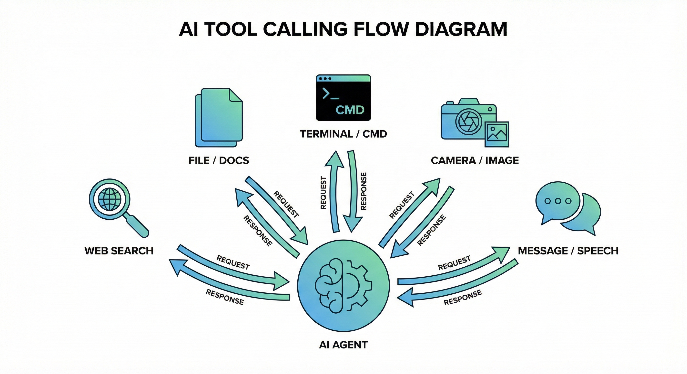

# Agent Loop：一场AI的独白与工具交响曲

> *"思考是最孤独的行为，直到它被表达出来。"*
> 
> 在OpenClaw的世界里，Agent Loop就是这场从孤独思考到外在表达的全过程。它不是简单的"输入-处理-输出"，而是一场精心编排的交响乐——有前奏、有变奏、有高潮，偶尔还有即兴的间奏（我们称之为工具调用）。

---

## 当一条消息闯入AI的世界

想象一下这个场景：你正在Telegram上和OpenClaw闲聊，突然问了一句"帮我查一下明天北京的天气，然后发邮件提醒我穿外套"。对AI来说，这短短一句话触发了一个复杂得令人咋舌的连锁反应。

在OpenClaw的架构中，这条消息的旅程始于**Gateway的chat事件**，经过Provider的标准化，变成一条结构化的消息进入Gateway的消息总线。但真正的魔法从`agent` RPC调用开始——这是整个Agent Loop的入口。

Gateway收到消息后不会直接扔给模型，而是先做三件事：

第一，**会话解析**。它要搞清楚"你是谁"、"我们在哪聊"、"之前聊过什么"。这决定了AI应该用什么样的上下文、什么样的工具权限、什么样的回复风格来回应你。

第二，**运行排队**。OpenClaw使用了一个巧妙的队列系统来确保同一会话中的消息按顺序处理。想象一下，如果你在Telegram上连续发了三条消息，你不会希望AI对第一条的回复穿插在对第三条的回复中间——那场面简直是一场灾难。

第三，**环境准备**。Gateway要加载Skills快照、准备Workspace、注入系统提示词。这就像演出前的舞台布置：灯光、音响、道具，一样都不能少。

## Pi Agent Core：循环的心脏

OpenClaw并没有从零开始造一个Agent运行时——它站在巨人的肩膀上，使用了**Pi Agent Core**作为底层引擎。这是一个专门为大模型应用设计的运行时，负责处理最复杂的部分：模型调用、流式响应、工具执行。

当`runEmbeddedPiAgent`被调用时，它首先会构建一个**Pi Session**——这是一个封装了所有运行时状态的上下文，包括模型配置、认证信息、工具集、历史消息等。然后，它会订阅Pi Core的事件流，开始一场持续数秒甚至数分钟的"对话"。

这场"对话"的美妙之处在于它的**双向性**。不是简单的"我问你答"，而是模型可以主动说"等等，我需要查一下资料"，然后调用工具，等待结果，再继续回答。这就是Agentic Loop的精髓：**模型不是被动响应者，而是主动的问题解决者**。

```
用户消息
    ↓
模型推理："用户想知道天气... 但我不知道天气"
    ↓
模型决定：调用 weather 工具
    ↓
工具执行：获取北京明天天气
    ↓
工具结果返回模型
    ↓
模型继续推理："现在我知道天气了，但用户还要发邮件..."
    ↓
模型决定：调用 send_email 工具
    ↓
工具执行：发送邮件
    ↓
模型生成最终回复："已查好天气，邮件已发送"
```

这个循环可以持续多轮。模型可以一次调用多个工具，可以在工具结果不满意时再次调用其他工具，甚至可以请求用户澄清（"你想让我发给哪个邮箱？"）。**这种能力让AI从"聊天机器人"升级成了"任务执行者"**。

## 流式响应：让用户感受AI的"思考过程"

早期的聊天AI有一个让人抓狂的体验：你发送消息后，要等待好几秒，然后突然蹦出一大段回复。你不知道AI是在思考，还是卡住了，还是已经死机了。

OpenClaw采用了**流式响应**（Streaming）来解决这个问题。从模型生成第一个token开始，文字就像打字机一样实时出现在你的屏幕上。你不仅能看到AI在"说话"，还能看到它在"思考"——当它决定调用工具时，你会看到工具名称和参数；当工具执行时，你会看到进度提示；当工具返回结果时，你会看到AI如何基于新信息继续推理。

这种透明性带来了两个好处：

**心理层面**，用户不会焦虑地等待。即使最终回复需要10秒才能生成，但用户在前2秒就能看到AI开始回应，这种"被听见"的感觉大大提升了体验。

**实用层面**，用户可以及时纠正。如果AI理解错了你的意图，在流式输出的前几个字你就能发现，可以立即打断重说，而不是等到整段话都说完。

OpenClaw的流式系统分为三个通道：

- **`assistant`通道**：AI生成的文字内容，实时推送到用户界面
- **`tool`通道**：工具调用事件（开始、参数、结果），用于展示AI在做什么
- **`lifecycle`通道**：运行状态事件（开始、结束、错误），用于系统控制和日志记录

这三个通道通过WebSocket同时推送给客户端，客户端可以根据需要决定如何展示。比如在CLI中，工具事件可能以灰色小字显示；在WebChat中，工具事件可能折叠成可展开的卡片；在macOS App中，工具事件可能触发通知音效。

## 工具调用：AI的"超能力"

如果说语言模型的推理能力是AI的"大脑"，那么工具调用就是它的"手脚"。OpenClaw提供了一套丰富的工具集，让AI可以真正与数字世界交互。

工具系统的核心设计原则是**Schema驱动**。每个工具都用TypeBox定义了严格的输入输出Schema，模型在调用时必须提供符合Schema的参数。这不仅保证了类型安全，也让模型在调用前就能"理解"这个工具能做什么、需要什么。

OpenClaw的工具分为几大类：

**信息获取类**：`web_search`、`web_fetch`、`read`——让AI可以查询互联网、读取文件、获取最新信息，弥补训练数据的时效性局限。

**行动执行类**：`exec`、`browser`、`message`——让AI可以执行代码、控制浏览器、发送消息，真正"动手"完成任务。

**设备交互类**：`nodes.camera_snap`、`nodes.screen_record`、`canvas.present`——通过Node系统与物理世界交互，拍照、录屏、展示可视化内容。

**会话管理类**：`sessions_list`、`sessions_send`、`sessions_spawn`——让AI可以管理多个会话，甚至创建子Agent并行处理任务。

每个工具调用都是一个完整的请求-响应周期。模型生成工具调用指令，Gateway验证参数，执行工具，获取结果，将结果格式化为消息追加到对话历史中，然后让模型继续生成。这个过程对用户是透明的——你只看到AI在"思考"，然后"行动"，然后给出结果。

## Session管理：记忆的艺术

Agent Loop之所以能够持续多轮对话而不失上下文，关键在于**Session管理**。在OpenClaw中，Session不仅仅是一堆消息的集合，它是一个完整的状态容器。

每个Session有唯一的key（通常是`agent:main:main`这样的格式），包含：

- **消息历史**：所有用户和AI的对话记录，用于上下文理解
- **工具结果**：之前工具调用的结果缓存，避免重复执行
- **系统配置**：模型选择、思考级别、工具白名单等运行时参数
- **持久化存储**：可以保存到磁盘，下次启动时恢复对话

Session管理最棘手的问题是**上下文窗口限制**。大模型的上下文窗口虽然越来越大（Claude 3.5 Sonnet有200k token），但终究是有限的。当对话历史接近上限时，OpenClaw会触发**压缩**（Compaction）机制。

压缩不是简单的"删掉前面的消息"，而是让模型生成一份**对话摘要**，用几百字的摘要替代几千字的原始对话。这份摘要保留了关键信息（用户 preferences、已确认的事实、待办事项），丢弃了冗余内容（客套话、重复表达、临时性内容）。压缩后的Session可以继续使用，而对用户来说，AI依然"记得"之前的对话——只是不记得每一个字了。

## 超时、错误与优雅降级

任何复杂的系统都会出错，Agent Loop也不例外。OpenClaw设计了一套完整的**错误处理机制**来确保即使在最坏的情况下，用户也能得到体面的体验。

**超时处理**：每个Agent运行有默认600秒的超时限制。如果模型思考太久（比如陷入循环或处理超大文件），Gateway会强制中断并返回超时错误。这比无限等待要好得多——至少用户知道发生了什么。

**工具错误**：当工具执行失败时（比如网络不通、文件不存在、权限不足），错误信息会被捕获并返回给模型。模型可以根据错误信息决定是重试、换用其他工具、还是向用户解释问题。这种**错误反馈循环**让AI有了基本的故障恢复能力。

**优雅降级**：如果某个Skill加载失败、某个Node离线、或者某个模型API不可用，OpenClaw不会直接崩溃。它会标记这些资源为不可用，继续用剩余的资源完成任务。这种**韧性设计**让系统能够在部分失效的情况下继续服务。

## 结语：循环的意义

Agent Loop不仅仅是一个技术实现，它代表了一种新的计算范式：**从命令式到意图式**。

在传统的软件使用中，你需要精确地告诉计算机每一步怎么做（"打开浏览器，访问天气网站，输入城市名，读取温度"）。而在Agent Loop中，你只需要表达意图（"告诉我明天天气"），AI会自己 figuring out 如何完成。

这种转变的深层意义在于**认知负荷的转移**。人类不擅长记忆复杂的操作步骤，但擅长表达目标和意图。Agent Loop让计算机承担了"如何做到"的负担，让人类专注于"想要什么"。

OpenClaw的Agent Loop实现不是最完美的——它有时会出错，有时会误解，有时会在工具调用上浪费token。但它代表了正确的方向：**让AI成为主动的助手，而不是被动的工具**。

当这场从输入到输出的循环完成时，你收到的不仅仅是一个答案，而是一次完整的协作体验。这就是Agent Loop的魔力。

---

---


*图1：Agent Loop循环流程图——展示从输入处理到工具调用再到响应生成的完整循环*



*图2：AI工具调用流程图——展示AI Agent与各类工具（搜索、文件、终端、相机、消息）的交互*

---

**延伸阅读**

- [OpenClaw Gateway 架构详解](./02-gateway.md)
- [Skills与Nodes：开放生态](./04-ecosystem.md)
- [技术栈选型](./05-tech-stack.md)

---

*文档版本: 2026-02-03 | 作者: OpenClaw 技术文档团队*
